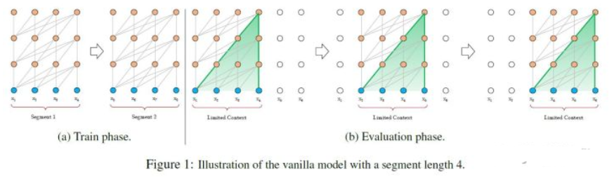

# Transfomer

- **Encoder**
    - 举例说明（假设序列长度固定，如100，如输入的序列是“我爱中国”）：
        - 首先需要 **encoding**：
            - 将词映射成一个数字，encoding后，由于序列不足固定长度，因此需要padding，
            - 然后输入 embedding层，假设embedding的维度是128，则输入的序列维度就是100*128；
        - 接着是**Position encodding**，论文中是直接将每个位置通过cos-sin函数进行映射；
            - 分析：这部分不需要在网络中进行训练，因为它是固定。但现在很多论文是将这块也embedding，如bert的模型，至于是encoding还是embedding可取决于语料的大小，语料足够大就用embedding。将位置信息也映射到128维与上一步的embedding相加，输出100*128
        - 经过**self-attention层**：
            - 操作：假设v的向量最后一维是64维(假设没有多头)，该部分输出100*64；
        - 经过残差网络：
            - 操作：即序列的embedding向量与上一步self-attention的向量加总；
        - 经过 **layer-norm**：
            - 原因：
                - 由于在self-attention里面更好操作而已；
                - 真实序列的长度一直在变化；
        - 经过 **前馈网络**：
            - 目的：增加非线性的表达能力，毕竟之前的结构基本都是简单的矩阵乘法。若前馈网络的隐向量是512维，则结构最后输出100*512；
- **Decoder**
    - 特点：与 encoder 类似
    - 组成结构介绍
        - masked 层：
            - 目的：确保了位置 i 的预测仅依赖于小于 i 的位置处的已知输出;
        - Linear layer：
            - 目的：将由解码器堆栈产生的向量投影到一个更大的向量中，称为对数向量。这个向量对应着模型的输出词汇表；向量中的每个值，对应着词汇表中每个单词的得分；
        - softmax层:
            - 操作：这些分数转换为概率（所有正数，都加起来为1.0）。选择具有最高概率的单元，并且将与其相关联的单词作为该时间步的输出
- **为何在获取输入词向量之后需要对矩阵乘以embedding size的开方？意义是什么？**
  
    在获取输入词向量后，将词向量矩阵乘以embedding size的开方是为了对词向量的范围进行缩放。这种缩放的目的是为了控制词向量的方差，使其有适当的尺度，以便更好地适应不同的神经网络模型。
    
    主要的原因如下：
    
    1. 控制方差：词向量的方差可以影响模型的训练稳定性。如果词向量的方差过大，可能导致模型训练过程中的梯度爆炸问题。通过对词向量矩阵乘以embedding size的开方，可以使词向量的方差适中，并降低梯度爆炸的风险。
    2. 数值稳定性：在神经网络模型中，各层的输入和输出的数值范围通常需要保持相对稳定。通过缩放词向量的范围，可以确保输入的数值范围在合理的范围内，避免模型的数值不稳定性问题。
    3. 梯度传播：词向量的范围可以影响梯度的传播。如果词向量的范围过大或过小，可能会导致梯度在网络中传播时出现问题，例如梯度消失或梯度爆炸。通过缩放词向量的范围，可以促进梯度在不同层之间更好地传播。
    
    需要注意的是，针对每个具体的任务或模型，对词向量进行缩放的具体方式可能会不同。上述将词向量矩阵乘以embedding size的开方只是常见的一种方式，实际情况可能因任务需求、模型架构等因素而有所差异。
    
- **有其他方法不用除根号dk吗？**
  
    有，只要能缓解梯度消失的问题就可以。详情可以了解Google T5的Xavier初始化。
    
- **简单介绍一下Transformer的位置编码？有什么意义和优缺点？**
  
    Transformer的位置编码是为了将序列中每个词的位置信息引入到模型中。在Transformer模型中，由于自注意力机制的使用，模型无法通过传统的位置索引来理解输入序列中的顺序信息。因此，通过位置编码来表示序列中每个位置的信息，以便模型能够感知序列中词的相对位置。
    
    Transformer使用的位置编码是通过在输入的词向量中添加一个位置向量来实现的。位置向量的维度与词向量的维度相同，其设计灵感来自于正弦和余弦函数。具体来说，位置编码使用了一组固定的公式计算得出，使得不同位置上的位置向量在空间中的表示有所不同。
    
    位置编码的意义和优缺点如下：
    
    意义：
    
    1. 引入位置信息：位置编码能够传达序列中每个位置的顺序信息，使模型能够区分不同位置上的词，并获取它们之间的相对距离。
    2. 模型泛化能力：位置编码的引入使得Transformer模型能够处理可变长度的序列输入，因为位置编码并不依赖于特定的输入序列长度。
    
    优点：
    
    1. 无需训练：位置编码是固定的，并不需要随训练一起调整参数。这样可以减少模型的训练时间和计算量。
    2. 捕获位置关系：位置编码能够帮助模型准确地表示词的相对位置，捕捉到距离和顺序的信息。
    
    缺点：
    
    1. 无法处理超出训练范围的序列长度：位置编码是通过固定的公式计算得到的，无法处理超出训练过程中已见过的最长序列长度的输入。
    2. 位置信息建模有限：位置编码只能提供词之间相对位置的信息，而无法提供绝对位置的信息。在某些特定任务中，绝对位置可能对模型的性能有重要影响。
    
    总体而言，位置编码在Transformer中为模型引入了位置信息，使其能够处理顺序相关的任务。该方法简单且高效，但仍存在一些限制，如对序列长度的限制和无法提供绝对位置信息。
    
    - **RoPE旋转位置编码**
      
        
        
    
    
    
- **简单讲一下Transformer中的残差结构以及意义。**
  
    残差结构的意义如下：
    
    1. 缓解梯度消失：深层神经网络中，通过层层堆叠的变换可能导致梯度逐渐变小，从而导致梯度消失问题。残差结构通过将原始输入直接传递给下一层，使得梯度能够更轻松地通过网络传播，从而缓解了梯度消失问题。
    2. 促进信息传递：残差结构保留了原始输入的信息，将其与经过子层变换后的输出相加。这样做的好处是能够保留更多的细节信息，有助于模型学习更多的细微特征，并促进信息在网络中的传递。
    3. 简化优化：残差结构使得每个子层的输出能够更接近于一个恒等映射，因为如果子层的变换没有提供更多的信息，输入将直接传递给下一层。这简化了网络的优化问题，降低了训练的难度。
- **Transformer的并行化提现在哪个地方？Decoder端可以做并行化吗？**
  
    在Transformer中，Encoder和Decoder都使用了自注意力机制。在Encoder中，每个位置的注意力权重是根据整个输入序列计算得出的，因此可以进行并行计算。这使得Encoder能够并行地处理整个输入序列，从而加快训练和推理速度。
    
    而在Decoder端，因为每个位置的输出依赖于之前已生成的位置，所以无法像Encoder那样直接进行并行计算。然而，仍然存在一些可以进行并行化的方法来提高Decoder的效率。
    
    一种常见的并行化方法是使用“Masked Self-Attention”，即在Decoder的自注意力机制中通过掩码将未来的位置（即当前位置之后的位置）屏蔽掉。这样可以确保在生成当前位置的输出时，只考虑前面已经生成的位置。
    
    此外，还有一种称为“Parallel Decoding”的方法，通过将未来的位置的注意力权重设置为0，可以在一定程度上实现Decoder端的并行化。这种方法可以利用多个GPU或多个计算单元同时生成输出。
    
    需要注意的是，Decoder的并行化仍然有一定限制，并不像Encoder那样完全并行计算。由于生成输出时的依赖关系，Decoder端的并行化可能会导致一些计算行之间的依赖关系，从而降低并行效率。
    
- **transfomer encoder 里面的mask 是怎么做的？**
  
    对输入序列的 padding 部分进行 Mask 操作是为了在计算注意力矩阵时忽略这些 padding 位置的影响。这是因为 padding 部分对模型的预测结果没有贡献，同时防止模型在 padding 位置生成不必要的注意力权重。
    
    在计算注意力矩阵时，可以使用一个 Mask 矩阵来将 padding 位置的注意力权重设置为一个较大的负无穷值（-∞）或一个极小的负数，以便在计算 softmax 时将其变为接近于零的概率，从而忽略这些位置。
    
    在encoder和decoder两个模块里都有padding mask，位置是在softmax之前，为什么要使用padding mask，是因为由于encoder和decoder两个模块都会有各自相应的输入，但是输入的句子长度是不一样的，计算attention score会出现偏差，为了保证句子的长度一样所以需要进行填充，但是用0填充的位置的信息是完全没有意义的（多余的），经过softmax操作也会有对应的输出，会影响全局概率值，因此我们希望这个位置不参与后期的反向传播过程。以此避免最后影响模型自身的效果，既在训练时将补全的位置给Mask掉，也就是在这些位置上补一些无穷小（负无穷）的值，经过softmax操作，这些值就成了0，就不在影响全局概率的预测。
    
- **transfomer decoder 里面的mask 是怎么做的？**
  
    让输入序列只看到过去的信息，而看不到未来的信息。padding位置置为-1000，再对注意力矩阵进行相加。
    
    sequence MASK是只存在decoder的第一个mutil_head_self_attention里，为什么这样做？是因为在测试验证阶段，模型并不知道当前时刻的输入和未来时刻的单词信息。也就是对于一个序列中的第i个token解码的时候只能够依靠i时刻之前(包括i)的的输出，而不能依赖于i时刻之后的输出。因此我们要采取一个遮盖的方法(Mask)使得其在计算self-attention的时候只用i个时刻之前的token进行计算。MASK矩阵的含义，每一行表示对应位置的token。例如在第一行第一个位置是0，其余位置是1，这表示第一个token在attention时，只看到它自己，它右边的tokens是看不到的。
    
- **有哪些tokenizer的方式**
    - word-level
    - char-level
    - subword-level:**尽量不分解常用词，而是将不常用词分解为常用的子词**，“annoyingly”可能被认为是一个罕见的单词，并且可以分解为“annoying”和“ly”。“annoying”并“ly”作为独立的子词会更频繁地出现。
      
        subword的分词往往包含了两个阶段,一个是encode阶段,形成subword的vocabulary dict,一个是decode阶段,将原始的文本通过subword的vocabulary dict 转化为 token的index然后进入embedding层.
        
    
    subword-level 最为常用，Llama的tokenizer是**BPE**。**BPE每一步都将最常见的一对*相邻数据单位*替换为该数据中没有出现过的一个*新单位* ，反复迭代直到满足停止条件。**
    
    合并字符可以让你**用最少的token来表示语料库**，这也是 BPE 算法的主要目标，即**数据的压缩**。在每个单词的末尾添加“</w>”标记以标识单词边界能够让算法知道**每个单词的结束位置**（因为我们统计相邻字符对时不能把**分别位于两个单词**中的字符对算进去），这有助于算法查看每个字符并找到频率最高的字符配对。“</w>”也能被算作字符对的一部分。
    
- **transformer为什么要用三个不一样的QKV？**
  
    K和Q的点乘是为了得到一个attention score 矩阵，用来对V进行提纯。K和Q使用了不同的W_k, W_q来计算，可以理解为是在不同空间上的投影。正因为有了这种不同空间的投影，增加了表达能力，这样计算得到的attention score矩阵的泛化能力更高。这里解释下我理解的泛化能力，因为K和Q使用了不同的W_k, W_Q来计算，得到的也是两个完全不同的矩阵，所以表达能力更强。
    
    但是如果不用Q，直接拿K和K点乘的话，你会发现attention score 矩阵是一个对称矩阵。因为是同样一个矩阵，都投影到了同样一个空间，所以泛化能力很差。这样的矩阵导致对V进行提纯的时候，效果也不会好。
    
- **Multi-Head Attention的作用**
  
    多头注意力的机制进一步细化了注意力层，通过以下两种方式提高了注意力层的性能：
    
    扩展了模型专注于不同位置的能力。当多头注意力模型和自注意力机制集合的时候，比如我们翻译“动物没有过马路，因为它太累了”这样的句子的时候，我们想知道“它”指的是哪个词，如果能分析出来代表动物，就很有用。
    
    为注意力层提供了多个“表示子空间”。对于多头注意力，我们不仅有一个，而且还有多组Query/Key/Value权重矩阵，这些权重矩阵集合中的每一个都是随机初始化的。然后，在训练之后，每组用于将输入Embedding投影到不同的表示子空间中。多个head学习到的Attention侧重点可能略有不同，这样给了模型更大的容量
    
    模型在对当前位置的信息进行编码时，会过度的将注意力集中于自身的位置, 论文中所使用的多头注意力机制其实就是将一个大的高维单头拆分成了ℎ个多头，ℎ越大，那么QKV就会被切分得越小，进而得到的注意力权重分配方式越多。
    
    我们的目的就是通过增加参数量来增强网络的容量从而提升网络表达能力。经过多头之后，我们还需要att_out线性层来做线性变换，以自动决定（通过训练）对每个头的输出赋予多大的权重，从而在最终的输出中强调一些头的信息，而忽视其他头的信息。这是一种自适应的、数据驱动的方式来组合不同头的信息。
    
- **Transformer中是怎么做multi head attention 的，这样做multi head attention，会增加它的时间复杂度嘛？**
    - Q1：怎么做的？
    - A: 把输入映射为多组QKV矩阵，每组分别计算注意力，再将每组的结果concat起来。
    - Q2：会增加时间复杂度吗？
    - A: 不会。Self-Attn的时间复杂度为: $O(n2⋅d),$ 这里，$n$是序列长度，$d$是Embedding的维度。Sef-Attn包括三个步骤：相似度计算，Softmax和加权平均。它们的时间复杂度是：相似度计算可以看作大小为$(n,d)$和$(d,n)$的两个矩阵相乘：$(n,d)×(d,n)=O(n2⋅d)$，得到一个$(n,n)$的矩阵。softmax的时间复杂度为$O(n2⋅d)$。加权平均的每一项可以看作大小为$(n,n)$和$(n,d)的$两个矩阵相乘: $(n,n)×(n,d)=O(n2⋅d)$所以，自注意力总的时间复杂度为$O(n2⋅d)$。
    
    而多头并不是循环计算每个头，而是通过transpose and reshapes（即经过矩阵矩阵的变换），再用矩阵乘法来完成的。
    
    原本（$n,d$）的输入，经过矩阵变换，拆解成维度为$(n,h,a)$的的矩阵，$h$为头的数量，$a$为每个头输入的维度，再调整n和h的顺序得到（$h,n,a）$的矩阵作为每个头的输入。
    
    这样，两个矩阵相乘$(h,n,a)×(h,a,n)$可以看做是两个小矩阵相乘$(n,a)×(a,n)$做$h$次，所以时间复杂度为$O(n2⋅h)=O(n2⋅d$)。
    
- **Transformer attention的注意力矩阵的计算为什么用乘法而不是加法？**
  
    为了计算更快。加法形式是先加、后tanh、再和V矩阵相乘，相当于一个完整的隐层。
    
    在计算复杂度上，乘法和加法理论上的复杂度相似，但是在实践中，乘法可以利用高度优化的矩阵乘法代码（有成熟的加速实现）使得点乘速度更快，空间利用率更高。（论文P4有解释）
    
    在dk较小的时候，加法和乘法形式效果相近。但是随着 dk增大，加法开始显著优于乘法。作者认为，dk增大导致乘法性能不佳的原因，是**极大的点乘值将整个softmax推向梯度平缓区**，使得收敛困难。于是选择scale，除dk。
    
- **为什么transformer用Layer Norm？有什么用？**
  
    任何norm的意义都是为了让使用norm的网络的输入的数据分布变得更好，也就是转换为标准正态分布，数值进入敏感度区间，以减缓梯度消失，从而更容易训练。
    
    当然，这也意味着舍弃了除此维度之外其他维度的其他信息。为什么能舍弃呢？请看下一题。
    
- **为什么不用BN？**
  
    首先要明确，如果在一个维度内进行normalization，那么在这个维度内，相对大小有意义的，是可以比较的；但是在normalization后的不同的维度之间，相对大小这是没有意义的.
    
    BN(batch normalization)广泛应用于CV，针对同一特征，以跨样本的方式开展归一化，也就是对不同样本的同一channel间的所有像素值进行归一化，因此不会破坏不同样本同一特征之间的关系，毕竟“减均值，除标准差”只是一个平移加缩放的线性操作。
    
    那为什么NLP中不用BN，而用LN呢？道理一样，因为NLP中：
    
    - 对不同样本同一特征的信息进行归一化没有意义：
    - 三个样本（为中华之崛起而读书；我爱中国；母爱最伟大）中，“为”、“我”、“母”归一到同一分布没有意义。
    - 舍弃不了BN中舍弃的其他维度的信息，也就是同一个样本的不同维度的信息：
    - “为”、“我”、“母”归一到同一分布后，第一句话中的“为”和“中”就没有可比性了，何谈同一句子之间的注意力机制？
- **Transfomer 怎么处理长文本**
    1. 方法一：直接截断的方法
       
        截断句子方式（Transformer 处理方式）【这个也是 Transformer 和 Bert 中用到的方法】
        
    2. 方法二：抽取重要片段
       
        抽取长文本中比较主要的段落作为摘要，然后输入模型
        
    3. 方法三：将句子划分为 多个 seg ([Vanilla Transformer](https://aaai.org/ojs/index.php/AAAI/article/view/4182) 处理方式);
        - 思路：
            - 将文本划分为多个segments；
            - 训练的时候，对每个segment单独处理；
            
            