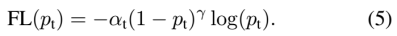

# 机器学习

- **常用的损失函数有哪些？分别适用于什么场景？**
  
    常用的损失函数有很多种，不同的损失函数适用于不同的机器学习任务和模型。下面介绍一些常见的损失函数及其适用场景。
    
    1. 均方误差（Mean Squared Error，MSE）：MSE是回归任务中最常见的损失函数之一，计算预测值与真实值之间的平均差的平方。适用于输出连续数值的回归任务。
    2. 平均绝对误差（Mean Absolute Error，MAE）：MAE是回归任务中另一种常见的损失函数，计算预测值与真实值之间的平均绝对差。与MSE相比，MAE更适合对异常值不敏感的情况。
    3. 交叉熵损失函数（Cross-entropy Loss）：交叉熵损失函数是分类任务中最常用的损失函数之一，通过计算真实标签与预测标签之间的交叉熵来度量分类器的性能。适用于多分类和二分类任务。
    4. 二元交叉熵损失函数（Binary Cross-entropy Loss）：二元交叉熵损失函数是二分类任务中常用的损失函数，计算真实标签与预测标签之间的交叉熵。与交叉熵损失函数类似，但适用于只有两个类别的分类任务。
    5. 对数损失函数（Logarithmic Loss）：对数损失函数是用于二分类任务的另一种损失函数，计算预测标签为真实标签的概率的对数的相反数。适用于二分类任务，尤其是当模型输出概率时。
    6. Hinge损失函数：Hinge损失函数是用于支持向量机（SVM）的损失函数，通过计算误分类点到超平面的距离来度量SVM的性能。适用于二分类任务。
    7. KL散度损失函数（Kullback-Leibler Divergence Loss）：KL散度损失函数用于测量两个概率分布之间的差异。适用于生成模型的训练，如自编码器和生成对抗网络。
    8. Triplet损失函数：Triplet损失函数是用于人脸识别和图像检索任务的损失函数，通过最小化同一类别的样本之间的距离，并最大化不同类别的样本之间的距离来学习特征空间。
    
    总的来说，不同的损失函数适用于不同的机器学习任务和模型。在实际应用中，我们需要根据具体的问题来选择合适的损失函数。
    
- **梯度下降与拟牛顿法的异同？**
  
    梯度下降和拟牛顿法都是优化算法，用于求解机器学习中的损失函数的最小值。它们的主要区别在于更新参数时计算目标函数梯度的方式不同。
    
    梯度下降是一种基于一阶导数的优化算法，它通过计算目标函数在当前参数位置的梯度方向，并沿着该方向更新参数。具体来说，假设当前的参数为*θ*，损失函数为*J*(*θ*)，则梯度下降算法的迭代公式为：
    
    $*θ(t + 1) = θ(t) − η∇θJ(θ(t))*$
    
    其中，*η*是学习率，表示更新的步长大小，∇*θJ*(*θ*(*t*))表示目标函数在当前参数位置*θ*(*t*)的梯度。梯度下降的缺点在于，由于每次更新只考虑了当前位置的梯度，因此可能会出现步长过大或过小的情况，导致优化过程过程缓慢或者错过最优解。
    
    拟牛顿法是一种基于二阶导数的优化算法，它通过估计目标函数的Hessian矩阵，来确定更新参数的方向和步长。具体来说，假设当前的参数为*θ*，损失函数为*J*(*θ*)，则拟牛顿法的迭代公式为：
    
    $*θ(t + 1) = θ(t) − H − 1∇θJ(θ(t))*$
    
    其中，*H*是Hessian矩阵的近似值，通常使用BFGS算法或L-BFGS算法来估计。由于拟牛顿法考虑了目标函数的二阶导数信息，因此可以更快地收敛到最优解，并且可以自适应地调整步长大小。
    
    总的来说，梯度下降和拟牛顿法都是优化算法，用于求解机器学习中的损失函数的最小值，它们的主要区别在于参数更新时计算目标函数梯度的方式不同。梯度下降只考虑了一阶导数，计算简单，但可能出现步长过大或过小的情况，收敛速度较慢；拟牛顿法考虑了二阶导数信息，可以更快地收敛到最优解，但计算复杂度较高。
    
- **L1和L2正则分别有什么特点？为何L1稀疏？**
  
    L1和L2正则是机器学习中常用的正则化方法，它们通过对模型的参数进行约束，可以有效防止过拟合。它们的主要区别在于对参数的惩罚方式不同。
    
    L1正则（L1 regularization），也称为Lasso正则化，它通过将模型参数的L1范数作为正则化项来约束模型的复杂度。具体来说，L1正则的目标函数为：
    
    $\min\limits_{\theta}\ \frac{1}{m}\sum\limits_{i=1}^{m}{L(y_i,f(x_i,\theta))} + \lambda\sum\limits_{j=1}^{n}{|\theta_j|}$
    
    其中，*m*表示样本数量，*n*表示模型的参数数量，*L*表示损失函数，*yi*和*xi*分别表示第*i*个样本的标签和特征，*θ*表示模型参数，*λ*表示正则化强度。可以看到，L1正则对模型参数的惩罚项是每个参数的绝对值之和，这会使得一些参数变成0，因此可以用于特征选择，即可以用于降维和过滤掉不相关的特征。
    
    L2正则（L2 regularization），也称为Ridge正则化，它通过将模型参数的L2范数作为正则化项来约束模型的复杂度。具体来说，L2正则的目标函数为：
    
    $\min\limits_{\theta}\ \frac{1}{m}\sum\limits_{i=1}^{m}{L(y_i,f(x_i,\theta))} + \lambda\sum\limits_{j=1}^{n}{\theta_j^2}$
    
    可以看到，L2正则对模型参数的惩罚项是每个参数的平方和，这会使得每个参数都趋向于接近于0，但不会变成0，因此L2正则不能用于特征选择，但可以使模型更加稳定，具有更好的泛化能力。
    
    
    
- **计算K-means**
  
    ```python
    def kmeans(X, k):
        m, n = X.shape
        centroids = X[np.random.choice(m, k, replace=False), :]
        prev_centroids = np.zeros((k, n))
        distances = np.zeros((m, k))
    
        while np.sum(centroids != prev_centroids) != 0:
            prev_centroids = np.copy(centroids)
            distances = cdist(X, centroids)
            labels = np.argmin(distances, axis=1)
            for i in range(k):
                centroids[i, :] = np.mean(X[labels == i, :], axis=0)
    
        return centroids, labels
    ```
    
- **常用的特征筛选方法有哪些？**
  
    特征筛选是在机器学习和数据挖掘中用于减少特征数量，提高模型性能和减少过拟合的一种技术。以下是一些常用的特征筛选方法：
    
    1. 方差阈值：删除方差低于给定阈值的特征。这种方法适用于特征中有大量常数或接近常数的情况。
    2. 相关性阈值：删除与目标变量不相关的特征。可以使用皮尔逊相关系数或其他相关性测量指标来计算特征与目标变量之间的相关性。
    3. 卡方检验：卡方检验可用于评估分类变量之间的关系。可以使用卡方检验来评估每个特征与目标变量之间的关系，并删除关系不强的特征。
    4. 互信息：互信息可用于评估特征与目标变量之间的非线性关系。与卡方检验类似，可以使用互信息来评估每个特征与目标变量之间的关系，并删除关系不强的特征。
    5. L1 正则化：使用 L1 正则化可以对特征进行稀疏化，即使一部分特征的系数为零。使用 L1 正则化可以删除一些不重要的特征。
    6. 基于树的特征重要性：决策树和随机森林等基于树的算法可以计算特征的重要性。可以使用这些算法来评估每个特征对目标变量的影响，并删除重要性较低的特征。
    7. 基于模型的特征选择：可以使用任何基于模型的特征选择方法来评估每个特征对目标变量的影响，并删除不重要的特征。例如，可以使用 Lasso 回归、岭回归、逻辑回归等模型。
    
    这些方法并不是互斥的，可以组合使用，以提高特征筛选的效果。
    
- **树模型如何调参**
  
    树模型（包括决策树、随机森林、梯度提升树等）是一种基于树结构的机器学习模型，它们的超参数（即模型的参数之外的设置）对模型的性能和效率有重要影响。下面介绍一些调参的技巧：
    
    1. 树的深度和叶子节点个数：树的深度和叶子节点个数是控制树的复杂度的重要参数，它们直接影响模型的过拟合和欠拟合。可以通过交叉验证（Cross Validation）等方法来确定最优的深度和叶子节点个数。
    2. 特征子集大小：随机森林等集成学习模型中，每个决策树仅使用部分特征来进行划分，以降低模型的方差。可以通过交叉验证等方法来确定最优的特征子集大小。
    3. 内部节点最小样本数和叶子节点最小样本数：这两个参数控制了每个节点的最小样本数，从而可以控制树的生长。较小的值可以增加树的复杂度，较大的值可以减小过拟合的风险。可以通过交叉验证等方法来确定最优的最小样本数。
    4. 损失函数：梯度提升树等模型中，损失函数用于度量预测值与真实值之间的差距。不同的损失函数适用于不同的问题，比如均方误差适用于回归问题，交叉熵适用于分类问题。可以通过交叉验证等方法来确定最优的损失函数。
    5. 学习率和迭代次数：梯度提升树等模型中，学习率和迭代次数是两个重要的超参数。学习率控制每个基模型的权重，较小的学习率可以使模型更加稳定，但可能需要更多的迭代次数来达到最优解。迭代次数控制了模型的复杂度，可以通过交叉验证等方法来确定最优的学习率和迭代次数。
    6. 其他超参数：不同的树模型还有其他的超参数，比如决策树中的划分标准（比如基尼系数或信息熵），随机森林中的子采样比例，等等。可以通过交叉验证等方法来确定最优的超参数。
- **树模型如何剪枝？**
  
    树模型剪枝是一种减少模型复杂度，提高泛化能力的常见技术。常见的树模型剪枝算法包括预剪枝和后剪枝两种方法。
    
    预剪枝是在训练模型时，在树的构建过程中，根据一定的规则在节点的分裂前进行剪枝。预剪枝的主要思想是在决策树的生长过程中，当节点满足一定的条件时，不再进行分裂。具体来说，预剪枝的一些常见策略包括：
    
    1. 最大深度限制：限制树的最大深度。
    2. 最小样本数限制：限制节点的最小样本数，如果样本数量小于这个值，就不再进行分裂。
    3. 最小信息增益限制：限制节点分裂后的信息增益，如果信息增益小于这个值，就不再进行分裂。
    
    后剪枝是在训练完成后，对树进行修剪，去掉一些不必要的叶子节点，从而减少树的复杂度。具体来说，后剪枝的一些常见策略包括：
    
    1. 预测误差降低（PEP）：以测试集上的预测误差为评估标准，对叶子节点进行剪枝，如果剪枝后模型的预测误差没有变差，就进行剪枝。
    2. 等价子树剪枝：将同一层的兄弟节点合并成一个节点，然后计算合并前后模型的误差，如果误差没有变差，就进行剪枝。
    3. 最小化误差复杂度（MEC）：在PEP的基础上，增加一个正则化项，以平衡模型的预测误差和复杂度。
    
    需要注意的是，剪枝算法的效果往往受到数据集、模型结构、评估标准等多方面因素的影响，因此在具体应用中需要根据实际情况选择适当的剪枝算法和参数。
    
- **是否存一定存在参数，使得SVM的训练误差能到0**
  
    在SVM中，如果训练数据是线性可分的，即存在一个超平面能够完全将正负样本分开，那么可以通过调整SVM的参数，使得训练误差能够达到0。
    
    具体来说，如果训练数据是线性可分的，那么SVM的最优解就是所有支持向量的线性组合，而且SVM的分类决策函数是硬间隔。在这种情况下，可以通过设置一个较小的惩罚系数C，使得SVM更加关注正确分类，而不是最小化误差。
    
    当C趋近于无穷大时，SVM会将所有的数据点都分类正确，但这样可能会导致模型过于复杂，存在过拟合的风险。因此，在实际应用中，需要在训练误差为0的前提下，尽量选择一个较小的C值，从而使得模型具有更好的泛化能力。
    
- **逻辑回归如何处理多分类？**
  
    逻辑回归通常被用于处理二分类问题，但也可以用于多分类问题。逻辑回归解决多分类问题的主要方法是采用一对多（One-vs-Rest）或一对一（One-vs-One）策略。
    
    一对多策略也称为单分类策略。在这种策略下，对于K个类别中的每一个类别，都训练一个二分类模型。对于第i个类别，将所有属于该类别的样本标记为正例，将属于其他类别的样本标记为负例，然后训练一个二分类模型。这样，最终就会得到K个二分类模型，每个模型能够区分其中一个类别和其他所有类别的差异。在进行预测时，对于一个新的样本，将其输入到所有K个模型中，选择最高预测概率对应的类别作为分类结果。
    
    一对一策略是指对于K个类别中的每两个类别，训练一个二分类模型。对于第i个类别和第j个类别，将所有属于这两个类别的样本标记为正例，将属于其他类别的样本标记为负例，然后训练一个二分类模型。这样，最终就会得到K*(K-1)/2个二分类模型，每个模型能够区分其中两个类别的差异。在进行预测时，对于一个新的样本，将其输入到所有K*(K-1)/2个模型中，统计每个类别的得分，选择最高得分对应的类别作为分类结果。
    
    在实际应用中，一对多策略常常更常用，因为它具有较好的可扩展性和计算效率。而一对一策略由于需要训练更多的模型，可能会导致计算复杂度增加。
    
- **决策树有哪些划分指标？区别与联系？**
  
    决策树的划分指标是用来评价如何选择最优划分特征和划分点的指标，常用的划分指标包括信息熵、基尼指数和分类误差率。
    
    1. 信息熵（Entropy）：信息熵是度量样本集合纯度的指标，用来评价每个特征对样本分类的重要程度。信息熵越小，表示样本纯度越高，即样本中的大部分属于同一类别。计算公式为：$Ent(D)=-\sum_{k=1}^{|\mathcal{Y}|}p_klog_2p_k$，其中𝒴是所有类别的集合，*p*是样本中属于第k类的样本数占样本总数的比例。
    2. 基尼指数（Gini Index）：基尼指数也是用来评价样本集合的纯度，与信息熵类似。基尼指数越小，表示样本纯度越高，即样本中的大部分属于同一类别。计算公式为：$Gini(D)=\sum_{k=1}^{|\mathcal{Y}|}\sum_{k'≠k}p_kp_{k'}=1-\sum_{k=1}^{|\mathcal{Y}|}p_k^2$，其中𝒴是所有类别的集合，*p*是样本中属于第k类的样本数占样本总数的比例。
    3. 分类误差率（Classification Error）：分类误差率是用来评价样本集合的纯度的指标，与信息熵和基尼指数不同，分类误差率越小，表示样本纯度越高，即样本中的大部分属于同一类别。计算公式为：$Error(D)=1-\max\limits_{k∈\mathcal{Y}}p_k$，其中𝒴是所有类别的集合，*p*是样本中属于第k类的样本数占样本总数的比例。
    
    这三种指标都是度量样本集合的不确定性，信息熵和基尼指数更常用，分类误差率使用较少。信息熵通常用于分类较多的情况，基尼指数则用于分类较少的情况。两者的计算复杂度相似，但基尼指数在计算上略微简单，因此在实践中更常用。
    
- **简述SVD和PCA的区别和联系？**
  
    SVD（Singular Value Decomposition）和PCA（Principal Component Analysis）是两种常用的降维方法，它们的作用是将高维数据映射到低维空间，以减少数据的维度并去除噪声和冗余信息。
    
    SVD和PCA的区别：
    
    1. 目标不同：SVD是一种矩阵分解技术，旨在将一个矩阵分解成三个矩阵的乘积，其中中间的矩阵是对角矩阵，对角线上的元素称为奇异值，它们表示矩阵的重要程度。而PCA是一种基于特征值分解的线性变换方法，它通过找到原始数据的主成分，将数据转化为一个新的坐标系，使得每个主成分之间不相关。
    2. 矩阵形式不同：SVD可以对任何形式的矩阵进行分解，包括矩阵的非对称矩阵和稠密矩阵等，而PCA只适用于对称正定矩阵。
    3. 计算方式不同：SVD的计算过程比PCA复杂，需要对原始数据进行奇异值分解，而PCA的计算过程比较简单，只需要对协方差矩阵进行特征值分解。
    
    SVD和PCA的联系：
    
    1. 两者都是用于降维的方法，可以将高维数据转化为低维数据，以减少数据的冗余信息和噪声。
    2. 两者都是基于线性代数的方法，可以用于多种数据类型，包括图片、声音、文本等。
    3. 在某些情况下，SVD和PCA可以互相替代。例如，对于对称正定矩阵，它们的结果是等价的，因为协方差矩阵就是一个对称正定矩阵。此外，PCA可以使用SVD来实现，因为PCA的计算可以看做是对协方差矩阵进行特征值分解。
- **如何使用梯度下降方法进行矩阵分解？**
- **PCA的方法和步骤？**
  
    主成分分析（Principal Component Analysis，PCA）是一种常用的降维技术，用于将高维数据转换为低维表示。下面是PCA降维的一般方法和过程：
    
    1. **标准化数据**：对原始数据进行标准化处理，以确保每个特征具有相同的尺度。这可以通过减去均值然后除以标准差来实现。
    2. **计算协方差矩阵**：计算标准化后的数据的协方差矩阵。协方差矩阵描述了不同特征之间的线性相关性。
    3. **计算特征值和特征向量**：对协方差矩阵进行特征值分解，得到特征值和对应的特征向量。特征值表示每个特征向量的重要性，特征向量则表示数据在新的特征空间中的方向。
    4. **选择主成分**：根据特征值的大小，选择要保留的主成分数量。特征值较大的特征向量对应的主成分具有较高的重要性，因此可以选择前k个特征向量作为主成分，其中k是降维后的维度。
    5. **构造投影矩阵**：将选择的k个特征向量构造成投影矩阵，其中每个特征向量作为矩阵的列。
    6. **降维转换**：将标准化后的原始数据与投影矩阵相乘，得到降维后的数据表示。这相当于将数据投影到选定的主成分上，从而实现降维。
    
    PCA通过选择具有最大方差的主成分来捕捉原始数据的主要信息，并在保留尽可能多的信息的同时减少数据的维度。降维后的数据可以用于可视化、特征选择、去除冗余特征等任务。
    
    需要注意的是，PCA假设数据是线性可分的，并且可能无法捕捉非线性关系。在某些情况下，非线性降维技术如t-SNE或Autoencoder可能更适合。此外，PCA的结果也受数据的分布和特征之间的相关性等因素影响，因此在应用PCA之前，对数据的认知和理解非常重要。
    
- **样本不均衡如何处理？**
  
    样本不均衡指的是在分类问题中，不同类别的样本数量存在显著差异，这可能导致模型偏向于预测数量较多的类别，而忽略数量较少的类别。处理样本不均衡的方法主要包括以下几种：
    
    1. 重采样（Resampling）：通过增加少数类样本或减少多数类样本来使不同类别的样本数量相对均衡。重采样的方法主要包括上采样（Oversampling）和下采样（Undersampling）两种。上采样常用的方法有SMOTE（Synthetic Minority Over-sampling Technique），通过生成新的少数类样本来扩充样本集；下采样常用的方法有随机欠采样（Random Undersampling）和集群中心欠采样（Cluster Centroids Undersampling），通过删除多数类样本或者减少多数类样本的数量来缩小样本集。
    2. 加权（Weighting）：对不同类别的样本赋予不同的权重，使得少数类样本在训练过程中起到更大的作用。加权的方法通常是在损失函数中加入一个权重系数，使得少数类样本在计算损失时被赋予更大的权重。
    3. 生成新特征（Feature Engineering）：通过从原始特征中生成新的特征来提高模型性能。例如，在图像分类问题中，可以通过旋转、翻转、缩放等方式生成新的图像，并将其加入到训练集中。
    4. 集成学习（Ensemble Learning）：通过组合多个模型的预测结果来提高模型性能。例如，可以使用Bagging方法来训练多个基分类器，然后对其预测结果进行投票或求平均值来得到最终的预测结果。
    5. 改变阈值（Threshold）：对模型输出的概率或得分设置不同的阈值来改变分类结果。例如，可以将分类阈值从0.5调整为0.3，使得模型更倾向于将样本分为少数类。
    
    需要根据具体的问题和数据情况选择合适的方法来处理样本不均衡问题。
    
- **什么是生成模型什么是判别模型？**
    1. 生成模型（Generative Model）是指一种建模方法，通过对输入和输出之间的关系进行建模，从而推断出输入的概率分布以及由该分布产生的输出。生成模型的目标是建立一个能够生成与实际数据相似的数据集的模型，也可以用于数据的降维、生成样本、异常检测等任务。常见的生成模型包括朴素贝叶斯、高斯混合模型（GMM）和变分自编码器（VAE）等。
    2. 判别模型（Discriminative Model）是指一种建模方法，它直接对输入和输出之间的关系进行建模，目标是建立一个能够判别输入与输出之间关系的模型，常用于分类和回归等任务。判别模型主要关注对输出的预测，而不关注输入的分布情况。常见的判别模型包括线性回归、逻辑回归、支持向量机（SVM）和深度神经网络等。
    3. 通常来说，生成模型和判别模型是针对不同类型的问题而设计的。如果我们关注的是数据生成的过程，例如图像生成、语音合成等问题，那么我们可以使用生成模型；如果我们关注的是输入与输出之间的映射关系，例如分类、回归等问题，那么我们可以使用判别模型。在实际应用中，需要根据具体问题的特点来选择适合的模型类型。
- **xiaver normal initialiser 怎么初始化?**
  
    Xavier初始化器是一种常用的权重初始化方法，适用于神经网络的参数初始化。它旨在使每个神经元的输入具有相同的方差，从而在前向传播和反向传播过程中更好地保持梯度的稳定性。
    
    ```python
    W = random_uniform(shape, minval=-limit, maxval=limit)
    
    其中均匀初始化器 limit = sqrt(6 / (fan_in + fan_out))
    高斯初始化器：limit = sqrt(2 / (fan_in + fan_out))
    ```
    
- **怎么识别数据倾斜？造成数据倾斜的原因是什么？怎么缓解数据倾斜？**
  
    数据倾斜是指在数据集中某些类别或特征的分布不平衡，即某些类别或特征的样本数量明显偏离其他类别或特征。数据倾斜可能导致机器学习模型训练出现问题，因为模型可能会偏向于预测样本数量较多的类别或特征。为了识别和缓解数据倾斜，可以采取以下步骤：
    
    1. 可视化数据分布：通过绘制直方图、条形图或箱线图等可视化手段，观察数据集中每个类别或特征的样本数量分布情况。如果某些类别或特征的样本数量明显少于其他类别或特征，那么可能存在数据倾斜。
    2. 分类标签分布分析：对于分类问题，分析不同类别标签的分布情况。可以计算每个类别的样本数量或计算类别之间的比例，以了解数据倾斜的程度。
    3. 特征分布分析：对于特征数据，分析每个特征的取值范围和分布情况。如果某个特征的取值范围较小或者某些取值占据了绝大多数样本，可能存在数据倾斜。
    
    数据倾斜的原因可能包括：
    
    类别不平衡：在分类问题中，某些类别的样本数量明显少于其他类别。
    特征偏斜：某些特征的取值范围较小，或某些取值占据了绝大多数样本。
    为了缓解数据倾斜问题，可以尝试以下方法：
    
    1. 数据重采样：对于类别不平衡的问题，可以采取过采样或欠采样的方法。过采样可以增加少数类别的样本数量，而欠采样可以减少多数类别的样本数量，使得不同类别的样本数量更加均衡。
    2. 生成合成样本：使用生成对抗网络（GAN）或其他合成样本生成技术，人工生成一些合成样本来增加少数类别的样本数量。
    3. 类别权重调整：在训练模型时，可以为不同类别设置不同的权重，使得模型更加关注少数类别。这种方法通常适用于分类模型的损失函数中有权重参数的情况。
    4. 特征工程：对于特征偏斜的问题，可以对特征进行变换或组合，以增加特征的多样性和区分度。
    5. 集成方法：使用集成方法如Bagging、Boosting等，可以通过组合多个模型的预测结果来减轻数据倾斜带来的影响。
    
    以上方法的选择可以根据具体问题和数据集的情况来确定，可能需要进行一些实验和调整来找到适合的解决方案。
    
- **怎么改善样本不均衡？Focal loss？**
  
    样本难易分类角度怎么能够解决样本非平衡的问题，直觉上来讲样本非平衡造成的问题就是样本数少的类别分类难度较高。因此从样本难易分类角度出发，使得loss聚焦于难分样本，解决了样本少的类别分类准确率不高的问题，当然难分样本不限于样本少的类别，也就是focal loss不仅仅解决了样本非平衡的问题，同样有助于模型的整体性能提高。
    
    
    

### 集成学习

- **集成学习的分类？有什么代表性的模型和方法？**
  
    集成学习（Ensemble Learning）是一种通过将多个分类器组合来提高预测准确性的机器学习方法。常见的集成学习分类有以下几种：
    
    1. Boosting：Boosting 是一种序列化集成学习方法，其中每个模型都尝试修正其前一个模型的错误。代表性的模型包括 AdaBoost、Gradient Boosting 和 XGBoost。
    2. Bagging：Bagging 是一种并行集成学习方法，其中每个模型都是使用随机抽取的样本进行训练。代表性的模型包括随机森林（Random Forest）和 ExtraTrees。
    3. Stacking：Stacking 是一种层级集成学习方法，其中第一层使用多个模型进行预测，并将它们的输出作为输入用于训练第二层模型。代表性的模型包括神经网络。
    4. Blending：Blending 与 Stacking 类似，但不需要使用第二层模型进行整合。它将不同模型的预测结果简单加权平均。
    5. 场景集成学习：场景集成学习将数据分为多个场景，并在每个场景中使用不同的模型。代表性的方法包括异构集成学习（Heterogeneous Ensemble）和多任务学习（Multi-Task Learning）。
    
    总体来说，Boosting 和 Bagging 是最常用的集成学习方法，而 Stacking 和 Blending 则适用于更高级的问题，例如推荐系统和图像识别。
    
- **如何从偏差和方差的角度解释bagging和boosting的原理？**
  
    它们都是基于模型集成的思想，通过组合多个弱分类器来构建一个强分类器。下面从偏差和方差的角度解释这两种方法的原理：
    
    1. Bagging（自举汇聚法）
    
    Bagging的基本思想是通过自助采样法（bootstrap sampling）从原始训练数据集中抽取多个不同的子样本，对每个子样本独立地训练一个弱分类器，然后将多个弱分类器组合成一个强分类器。通过平均化多个分类器的预测结果，可以降低模型的方差，提高模型的泛化能力。
    
    从偏差和方差的角度来看，Bagging主要起到了降低模型方差的作用。由于每个弱分类器只是在子样本上进行训练，可能会忽略部分训练数据，导致模型存在一定的偏差。但是，由于通过自举采样得到的不同子样本之间具有较强的独立性，多个弱分类器的预测结果可以互相抵消，从而有效地减小了模型的方差，提高了模型的泛化能力。
    
    1. Boosting（提升法）
    
    Boosting的基本思想是通过迭代地训练弱分类器，每一轮训练时，根据前一轮训练的结果调整训练数据的权重，使得模型更加关注分类错误的样本，从而不断提高模型的性能。每个弱分类器都是针对前一轮训练的误差进行训练的，通过加权结合多个弱分类器的预测结果，可以得到一个强分类器。
    
    从偏差和方差的角度来看，Boosting主要起到了降低模型偏差的作用。由于Boosting会针对分类错误的样本进行训练，从而更加关注难以分类的数据，可以有效地降低模型的偏差，提高模型的准确率。但是，在Boosting的过程中，多个弱分类器的预测结果可能会出现比较大的波动，导致模型的方差较高。因此，为了平衡偏差和方差，Boosting通常采用一些正则化方法，如加权平均、剪枝等来提高模型的泛化能力。
    
- **GBDT的原理？和Xgboost的区别联系？**
  
    GBDT（Gradient Boosting Decision Tree）是一种基于决策树的集成学习算法，它通过迭代地训练一系列的决策树模型，并通过加权求和的方式进行集成。每次迭代都尝试纠正之前模型的预测误差，从而得到更加准确的预测结果。
    
    具体来说，GBDT算法的原理如下：
    
    1. 初始化模型：使用一个简单的模型（例如平均值）来初始化模型。
    2. 迭代训练：在每一轮迭代中，GBDT通过以下步骤来训练一个新的决策树模型：
        1. 计算残差：将当前模型的预测值与真实值相减，得到残差。
        2. 训练决策树：使用残差作为目标变量，训练一个新的决策树模型。
        3. 更新模型：将新的决策树模型与之前的模型进行加权相加，得到新的模型。
    3. 输出模型：最终输出迭代训练得到的所有决策树模型的加权和作为最终模型的预测结果。
    
    而Xgboost（eXtreme Gradient Boosting）则是在GBDT的基础上进行改进和优化的算法，具体区别如下：
    
    1. 对损失函数进行了改进，采用了二阶泰勒展开式来拟合损失函数，使得Xgboost可以同时处理分类和回归问题。
    2. 引入了正则化项，控制模型的复杂度，避免过拟合。
    3. 增加了对缺失值的处理能力，可以自动学习出缺失值所对应的分裂方向。
    4. 改进了GBDT中的决策树生成算法，引入了直方图算法，将连续的特征离散化成桶，减少了决策树生成的时间。
    5. 支持并行计算，在分布式环境下，可以利用多台计算机加速模型训练。
    
    总之，Xgboost是在GBDT的基础上进行了改进和优化，加入了更多的技巧，使得它在精度和效率上都有很大的提升，是一种性能非常优秀的集成学习算法。
    
- **adaboost和gbdt的区别联系？**
  
    AdaBoost（Adaptive Boosting）和GBDT（Gradient Boosting Decision Tree）都是常见的集成学习算法，但它们在很多方面有着不同的思想和实现方法。
    
    1. 基本思想：AdaBoost是一种迭代算法，每轮迭代训练一个弱分类器，并根据分类器的准确率来调整样本权重，使得错误分类的样本在下一轮迭代中得到更多的关注。GBDT也是一种迭代算法，但每轮迭代训练的是一个回归树模型，每个模型的训练目标是拟合上一轮模型的残差，最终将所有模型的输出相加得到最终的预测结果。
    2. 模型结构：AdaBoost通过线性组合多个弱分类器来构建一个强分类器，弱分类器之间没有依赖关系。GBDT通过级联多个回归树模型来构建一个强模型，每个模型都依赖于上一轮模型的预测结果。
    3. 样本权重：AdaBoost将错误分类的样本权重放大，使得这些样本在下一轮迭代中得到更多的关注，从而更容易被正确分类。GBDT不需要调整样本权重，因为每轮迭代训练的是上一轮模型的残差，而残差更容易被下一轮模型正确拟合。
    4. 损失函数：AdaBoost使用指数损失函数来调整样本权重，同时将多个弱分类器的输出进行加权平均。GBDT使用平方损失函数来拟合残差，同时将多个回归树模型的输出进行加权求和。
    5. 集成策略：AdaBoost通过加权表决的方式来集成多个弱分类器的输出，权重由分类器的准确率决定。GBDT通过级联多个回归树模型来构建一个强模型，每个模型的输出对最终结果的贡献是相加的。